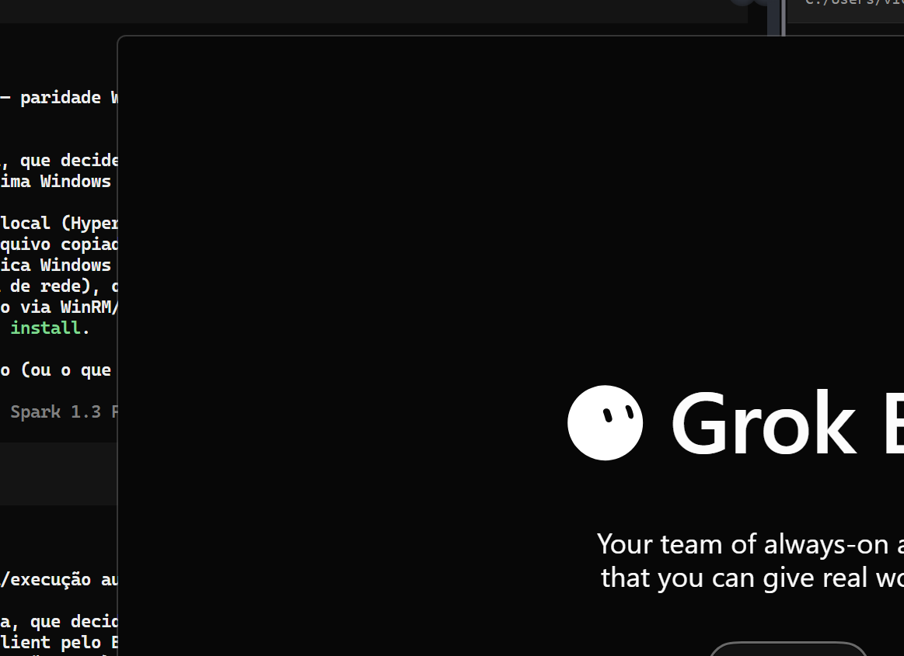

# Rodar no Windows: até onde chega

O upstream suporta um alvo só, macOS arm64. Este documento registra uma
investigação que foi bem mais longe do que a documentação sugeria — e o ponto
exato onde parou.

**Estado: o build conclui, o app inicializa, a UI renderiza.** O bloqueio de
build que travava esta investigação (`LNK1117`, ver "Bloqueio de build
(resolvido)" abaixo) está resolvido. O bloqueio de composição que impedia a
janela de aparecer — uma validação em
`source/electron-main/production-binding-providers.ts` que exigia duas APIs
exclusivas do macOS mesmo quando o processo roda no Windows — também está
resolvido: a janela "Grok Bot" abre e a tela de login renderiza. Ver
"Resultado da execução" e "A UI renderiza" abaixo, e a
[ADR 0008](decisions/0008-suporte-a-windows.md), que registra as quatro
escolhas por trás deste suporte e o estado alcançado.

## Por que era plausível

A Anysphere distribuiu o Grok Bot 0.18.0 **também para Windows x64**. O
aplicativo é multiplataforma; o que é macOS-only é a toolchain de reconstrução
que este fork herdou. Verificado no código:

- o runtime reconstruído **já carrega os ramos Windows** — `local-exec-native.ts`
  consulta processos via `Get-CimInstance Win32_Process`, o `box-exec-daemon` tem
  guardas `!== "win32"`, e `build-tree-sitter-electron.mjs` já previa `node-gyp.cmd`;
- de 1722 arquivos em `source/`, **um único diretório** é exclusivamente macOS:
  `packages/shell-exec/sandbox/macos`;
- a cadeia `build.mjs → clean-build → build-asar → asar-integrity` não usa
  **nenhuma** ferramenta macOS;
- para _rodar_ não é preciso empacotar — o bundle `.app`, o `codesign` e a
  notarização, que concentram todo o macOS, ficam de fora.

## O que já funciona

`scripts/bootstrap-windows.mjs` faz o equivalente Windows do
`bootstrap-runtime.mjs`, e roda ponta a ponta:

1. verifica o instalador NSIS por tamanho e SHA-256;
2. localiza o payload 7z embutido **por assinatura**, não por offset fixo;
3. extrai `resources/app.asar` e `app.asar.unpacked` com o **bsdtar que já vem no
   Windows** (`C:\Windows\System32\tar.exe`) — sem 7-Zip, sem dependência nova;
4. confere o SHA-256 do asar Windows;
5. hidrata `src/app/dist` chamando o `hydrateSourcePayloadFromAsar` **do upstream,
   sem alteração**.

O passo 5 é o achado central: o layout interno dos dois asars é idêntico
(`dist/electron-main`, `dist/host`, `dist/renderer`), então bastou passar outro
`expectedSha256`. Nada de verificação foi afrouxado — o digest Windows é um pino
**novo**, ao lado do macOS, que continua intacto.

|                             |                                                                    |
| --------------------------- | ------------------------------------------------------------------ |
| Instalador Windows          | `464079a15ef5fa8b61ccea8fffcc78f63cfcf6df65fb0ad5e725d8b95f7e437e` |
| `app.asar` Windows          | `38e85c0e5042c0257db7925e1e55709d6d155d90d92fe26ad654127d509766e0` |
| `app.asar` macOS (upstream) | `6665408168466f9cacc6087e917890c17f59d2e2e9c2404a5c4a59ad79c1de58` |

## Bloqueio de build (resolvido)

`node scripts/build.mjs` chegava a avançar até o estágio de nativos e falhava
em `stageNodeTreeSitterRuntime`, que compilava `tree-sitter` para o **ABI do
Node** (usado pelos daemons que rodam fora do Electron):

```
LINK : fatal error LNK1117: erro de sintaxe na opção 'opt:lldltojobs=2'
```

Isso era o `link.exe` da Microsoft recebendo uma flag do `lld`. Não era defeito
deste projeto: é a toolchain do Node 26 no Windows. MSVC Build Tools e Python
estavam presentes e eram encontrados corretamente; o `node-gyp` rodava; a
compilação é que quebrava na hora de linkar. O caminho de ABI Electron
(`build-tree-sitter-electron.mjs`) nunca chegou a ser exercitado, porque exige
`ELECTRON_HEADERS_DIR` — os headers oficiais do Electron 42.1.0, download
público e legítimo, mas mais um passo.

**A resolução não foi consertar o link — foi não precisar dele.** O instalador
Windows já traz todos os nativos compilados, confirmado em
`app.asar.unpacked/dist/deps`:

```
tree-sitter/build/Release/tree_sitter_runtime_binding.node
tree-sitter-bash/prebuilds/win32-x64/tree-sitter-bash.node
better-sqlite3/build/Release/better_sqlite3.node
cursor-proclist/build/Release/cursor_proclist.node
@anysphere/tree-chunk-napi/tree-chunk-napi.win32-x64-msvc.node
whichlang-node-win32-x64-msvc/whichlang-node.win32-x64-msvc.node
native/sand-webauthn-signer.exe
```

A dúvida que decidia isso era sob qual runtime os daemons (`box-exec-daemon`,
`local-exec-daemon`, `node-agent-coordinator`) sobem no Windows — Node do
sistema ou o Node embutido no Electron. Resposta medida: o Electron embutido.
`ELECTRON_RUN_AS_NODE=1` preserva `process.versions.electron`, então o processo
empacotado resolve `dist/deps` — o mesmo diretório que o instalador já traz —
em vez de precisar de um `dist/node-deps` reconstruído do zero.
`stageNodeTreeSitterRuntime`, em `build-tree-sitter-node.mjs`, agora tem uma
guarda de `process.platform === "win32"` que pula a compilação inteira; e
`lib/clean-build.mjs` parou de sobrepor `dist/node-deps` no Windows, como
consequência direta — senão a limpeza apagaria o que a guarda decidiu não
reconstruir. Nenhuma compilação de tree-sitter de ABI Node acontece mais no
Windows, e não precisa.

## Edições que isto custou

A lista cresceu desde esta primeira investigação e agora vive em um único
lugar, para não haver duas listas que divirjam:
[`CUSTOMIZATIONS.md`](CUSTOMIZATIONS.md) tem a tabela completa de arquivos
editados e novos, e a [ADR 0008](decisions/0008-suporte-a-windows.md) tem as
quatro escolhas que os sustentam — a quarta é a edição em `source/` descrita
em "A UI renderiza" abaixo. Hoje são **11 arquivos do upstream editados**
(eram 9 antes desta leva) e **sete arquivos novos** de scripts e testes,
todos marcados `[FORK]`, mais a edição pontual em `source/` que não está
nessa contagem porque é de categoria diferente: toolchain de build versus
código do produto.

Uma nota que vale reter aqui: a troca do node-gyp. O upstream chamava o shim
`node-gyp.cmd`, e desde a correção do CVE-2024-27980 o `spawn` de um `.cmd` sem
`shell: true` falha com `EINVAL` no Windows. Usar `shell: true` trocaria um
problema por outro (quoting de caminhos com espaço), então passamos a invocar
o JS do node-gyp com o próprio Node — sem shim, sem shell, igual nas três
plataformas.

## Riscos que continuam de pé

- **O sandbox não tem contraparte.** `packages/shell-exec/sandbox/macos` é
  Seatbelt; o que depender dele vai falhar ou precisará ficar desligado no
  Windows. A UI agora renderiza (ver "A UI renderiza" abaixo), mas ninguém
  autenticou e nenhuma funcionalidade além da tela inicial foi exercitada —
  qualquer caminho que dependa do sandbox continua só se medindo quando essas
  funcionalidades forem de fato usadas.
- **A reconstrução foi validada contra o asar macOS.** O patch do renderer
  localiza chunks por padrão de conteúdo e não por hash fixado, o que é
  favorável. O renderer agora roda no Windows e produz a tela de login
  esperada (ver evidência abaixo), mas isso ainda não cobre login real nem o
  restante da superfície do app.
- **A superfície de diff cresceu.** De 9 para 11 arquivos do upstream editados
  na leva anterior, mais um agora em `source/` (ver "A UI renderiza" abaixo),
  mais sete arquivos novos — ver [`CUSTOMIZATIONS.md`](CUSTOMIZATIONS.md) e a
  [ADR 0008](decisions/0008-suporte-a-windows.md). Se o Windows não for
  seguir, vale reverter em vez de manter código não exercitado; nenhuma dessas
  edições altera comportamento em `darwin`.

## Resultado da execução (2026-09-06)

**Subiu e quebrou em runtime — antes de qualquer janela.** Nem sucesso nem o
bloqueio de build antigo: o processo Electron chegou a inicializar, mas a
composição de bindings de produção do main process aborta antes de criar a
`BrowserWindow`.

O build (`apps/desktop/.build/fidelity/app`) já estava montado, com
`dist/deps` staged (`tree-sitter`, `tree-sitter-bash`, `better-sqlite3`,
`whichlang-node-win32-x64-msvc`, etc.) — a hipótese de "suspeito nº 1:
`dist/deps` não estagiado" **não se confirmou**, o diretório está completo.

Rodado com `cd apps/desktop && node scripts/run-windows.mjs`. Saída completa:

```
Electron: C:\dev\grok-bot.worktrees\win-impl\node_modules\electron\dist\electron.exe
App:      C:\dev\grok-bot.worktrees\win-impl\apps\desktop\.build\fidelity\app

[sand-electron-main] fatal composition failure: Error: Electron production binding requires electron.app.isInApplicationsFolder()..
```

Nenhuma janela abriu — confirmado via `Get-Process -Id <pid_do_electron> |
Select MainWindowHandle`, que voltou `0`. O processo principal do Electron
ficou vivo em segundo plano (junto com os processos auxiliares `--type=gpu-process`
e `--type=utility` que ele mesmo lança), sem UI nenhuma, até ser encerrado
manualmente (`Stop-Process`) — não foi deixado rodando.

**Causa raiz identificada, não é o suspeito nº 1 do plano.** Não é
`packages/shell-exec/sandbox/macos` (esse caminho nem chega a ser exercitado
antes da falha). É `source/electron-main/production-binding-providers.ts`,
função `createProductionStartupBinding` (por volta da linha 464-475):

```ts
for (const [value, label] of [
  [ports?.app?.setPath, "electron.app.setPath()."],
  [ports?.app?.getPath, "electron.app.getPath()."],
  [ports?.app?.isInApplicationsFolder, "electron.app.isInApplicationsFolder()."],
  [ports?.app?.moveToApplicationsFolder, "electron.app.moveToApplicationsFolder()."],
  [ports?.app?.relaunch, "electron.app.relaunch()."],
  [ports?.app?.exit, "electron.app.exit()."],
  [ports?.dialog?.showMessageBox, "electron.dialog.showMessageBox()."],
] as const)
  requireFunction(value, label);
```

Essa validação roda incondicionalmente, sem checar `process.platform`.
`electron.app.isInApplicationsFolder` e `electron.app.moveToApplicationsFolder`
são APIs **exclusivas do macOS** — no Electron para Windows a propriedade nem
existe no objeto `app`, então `typeof value !== "function"` é verdadeiro e
`requireFunction` lança. O uso real dessas APIs (em
`source/electron-main/startup/move-to-applications-folder.ts`) já é
corretamente condicionado a `options.platform !== "darwin"` — o bug está só na
validação prévia de bindings, que exige a função existir mesmo em uma
plataforma onde ela nunca vai ser chamada.

Ou seja: o `SAND_PACKAGED=1` fez exatamente o que deveria (o app achou o
runner do Electron e tentou montar os bindings de produção); o bloqueio é uma
checagem de composição que faltou tornar platform-aware, não um problema de
empacotamento nem do sandbox do macOS.

**O que não foi testado:** renderização da UI, autenticação, qualquer
funcionalidade além do arranque do main process. Como o processo nunca chega a
criar janela, nada do renderer chegou a rodar.

**Próximo passo óbvio** (fora do escopo desta tarefa): tornar
`createProductionStartupBinding` platform-aware — pular a exigência de
`isInApplicationsFolder`/`moveToApplicationsFolder` fora do `darwin`, do mesmo
jeito que `moveToApplicationsFolderIfNeeded` já faz.

## A UI renderiza (2026-09-07)

O próximo passo apontado acima foi feito, e destravou a UI: a janela "Grok
Bot" abre e a tela de login renderiza.

**A edição.** Em
`source/electron-main/production-binding-providers.ts`,
`createProductionStartupBinding` passou a exigir
`electron.app.isInApplicationsFolder` e `electron.app.moveToApplicationsFolder`
só quando `platform === "darwin"`, em vez de em toda plataforma. Não é um
afrouxamento de validação: o único consumidor real dessas duas funções,
`moveToApplicationsFolderIfNeeded` em
`source/electron-main/startup/move-to-applications-folder.ts:19`, já retornava
cedo com `options.platform !== "darwin"` e nunca chegava a chamá-las fora do
macOS. A pré-condição de composição passou a espelhar exatamente o gate que já
existia no ponto de uso — só ficou mais cedo, então o erro (se algum dia
acontecer) aparece na composição dos bindings em vez de mais tarde dentro de
`moveToApplicationsFolderIfNeeded`.

**Evidência.** Confirmado via DevTools Protocol, lendo o DOM do processo
renderer depois que o app subiu com `node scripts/run-windows.mjs`:

- `firstHeading`: `"Grok Bot"`;
- botão `"Sign in"` presente;
- texto `"Your team of always-on agents that you can give real work to."`
  presente;
- carregado de `.build/fidelity/app/dist/renderer/index.html` — o mesmo
  renderer hidratado pelo `bootstrap-windows.mjs` (ver "O que já funciona"
  acima), agora efetivamente executado.



**O que não foi testado.** Isto continua uma investigação de arranque, não uma
validação de produto:

- login de verdade — a tela renderiza, mas ninguém autenticou;
- qualquer funcionalidade além da tela inicial;
- o sandbox (`packages/shell-exec/sandbox/macos`, Seatbelt) continua sem
  contraparte Windows — o que depender dele vai degradar, e isso só se mede
  exercitando as funcionalidades que o usam, o que ainda não aconteceu.

**Por que esta edição é diferente de todas as anteriores.** Toda a
investigação Windows até aqui — bootstrap, build, os 11 arquivos editados e
sete novos catalogados em [`CUSTOMIZATIONS.md`](CUSTOMIZATIONS.md) — tocou
`scripts/`, a toolchain de build deste fork. Esta é a **primeira edição em
`source/`**, o código reconstruído do próprio **produto**, que o restante
deste dossiê trata como superfície a tocar o mínimo possível. É uma categoria
de risco diferente, e foi feita com autorização pontual do usuário para
reavaliar depois — não uma decisão tomada por padrão.
